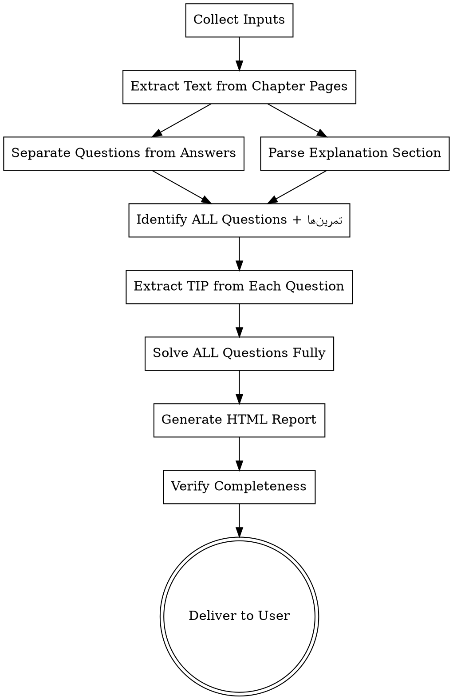

# Complete Exam Prep from PDF

## Overview

**MAIN IDEA:** Extract EVERY question and تمرین from the chapter and solve ALL of them.

This skill:
1. **Reads ALL questions (MCQs, exercises, etc.) from the PDF**
2. **Includes every تمرین with all its sub-parts (a, b, c, ...)**
3. **Creates a tip card for EVERY question** (even straightforward ones)
4. **Solves EVERY question** — not just a curated subset
5. **Produces a comprehensive HTML report** with all questions and solutions

**Output ALL content in Persian (فارسی).**

## When to Use

- User wants exhaustive exam prep covering every question
- User wants ALL exercises solved, not just the tricky ones
- User wants a complete reference of every question in a chapter
- User says "analyze all questions", "solve everything", "complete prep", "include تمرین‌ها"

**Do NOT use when:**
- User only wants tricky/important questions (use `exam-prep-from-pdf` instead)
- User wants summary notes only (use `cram-notes` instead)
- PDF contains no questions or answer sheets

## Input Requirements

| Input | Description | Required |
|-------|-------------|----------|
| **PDF file** | Path to the textbook PDF | Yes |
| **Chapter name** | Name/title of the chapter | Yes |
| **Chapter pages** | Page range containing BOTH questions AND answer sheets | Yes |
| **Textbook section** | Page range containing explanation/theory | Yes |

**Note:** The chapter pages typically contain questions first followed by answer sheets. Both sections are in the same page range — parse and separate them internally.

## Workflow



## Phase 1: Extract Content from PDF

### Extract Chapter Pages (Questions + Answers Combined)
```bash
python3 -c "
from pypdf import PdfReader
reader = PdfReader('textbook.pdf')
for i, page_num in enumerate(range(PAGE_START-1, PAGE_END)):
    print(f'=== PAGE {page_num+1} ===')
    print(reader.pages[page_num].extract_text())
" > chapter_extracted.txt
```

### Extract Explanation Section
```bash
python3 -c "
from pypdf import PdfReader
reader = PdfReader('textbook.pdf')
for i, page_num in enumerate(range(EXPLANATION_START-1, EXPLANATION_END)):
    print(f'=== EXPLANATION PAGE {page_num+1} ===')
    print(reader.pages[page_num].extract_text())
" > explanation_extracted.txt
```

**Read both files completely before proceeding.**

### Separate Questions from Answers

The chapter pages contain both questions and their answer sheets. Parse them by detecting structural boundaries:

**Separation signals:**
- Questions section: numbered items (Q1, Q2, 1., 2., Exercise 3.1), problem statements ending with `?`
- Answer section headers: "Answers", "Solutions", "پاسخ", "جواب", "Answer Key", "Model Answers"
- Answer section: typically starts after all questions, has step-by-step reasoning, final boxed answers

**Strategy:**
1. Scan the full extracted text
2. Find the boundary marker (e.g., "Answers" heading or a page where solution format begins)
3. Split into `questions_text` (before boundary) and `answers_text` (after boundary)
4. If no clear boundary, check each page: pages with problem statements = questions, pages with derivations/final answers = answers

## Phase 2: Identify ALL Questions and تمرین‌ها

**CRITICAL: Find every question.** Do not skip any.

For each question, extract:
- **Question number** (e.g., سوال ۱, Q1, etc.)
- **Question type** — either `چهارگزینه‌ای` (MCQ) or `تمرین`
- **For تمرین questions**, identify ALL sub-parts (a, b, c, d, ...)
- **Full question text** (verbatim)
- **Topic/concept** being tested

### How to Identify تمرین Questions

تمرین questions are typically:
- Listed after the MCQ section
- Numbered differently (e.g., 1, 2, 3 or تمرین ۱, تمرین ۲)
- Have sub-parts labeled (الف), (ب), (پ), (ت), (ث), or (a), (b), (c), etc.
- Often ask for analysis, proof, or algorithm design rather than multiple choice
- May span multiple pages

### Count All Questions

```
Total MCQ questions found: ___
Total تمرین questions found: ___
Total تمرین sub-parts found: ___
Expected total (from scanning): ___
```

If any mismatch, re-scan the PDF until you find every question.

## Phase 3: Parse Answers

For every question (and every sub-part of every تمرین), extract from the answer key:
- **Question number** (matched to question)
- **Full solution reasoning** (complete step-by-step)
- **Final answer** (the correct option for MCQ, or result for تمرین)
- **Key formulas/concepts** used
- **Common mistakes** implied by the solution

## Phase 4: Extract Tips from EVERY Question

For EVERY question (including every تمرین sub-part), extract a tip:

```
سوال N: [متن کوتاه سوال]
نکته: [یک جمله — چه چیزی یاد می‌گیرید]
دلیل اهمیت: [چرا این نکته برای امتحان مهم است]
```

**Unlike `exam-prep-from-pdf`, there is NO scoring or filtering.** Every question gets included. Even straightforward "apply formula" questions get a tip summarizing the formula or approach.

For تمرین questions, each sub-part gets its own tip card labeled `تمرین N-حرف` or a combined tip for the whole تمرین with all parts listed.

## Phase 5: Solve ALL Questions Fully

**Solve every single question.** Do not skip any.

### Solve Template for MCQ Questions

```
سوال N: [متن کامل سوال]

پاسخ صحیح: گزینه [X]

حل کامل:
  مرحله ۱: ...
  مرحله ۲: ...
  مرحله ۳: ...

نکته اصلی: [مهم‌ترین چیزی که باید به خاطر بسپارید]
```

### Solve Template for تمرین Questions

For each تمرین, include the full question text and then solve each sub-part:

```
تمرین N: [متن کامل تمرین]

بخش (الف):
  [متن بخش الف]
  حل: ...
  نکته: ...

بخش (ب):
  [متن بخش ب]
  حل: ...
  نکته: ...
```

## Phase 6: Generate HTML Report

### HTML Structure

The HTML has TWO main sections:

1. **لیست نکات** — tip cards for ALL questions (quick overview)
2. **سوالات حل شده** — ALL questions fully solved (not just a subset)

### Required Statistics

```
تعداد کل سوالات: (MCQs + تمرین‌ها, counting each sub-part)
تعداد نکات استخراج شده: (same as total)
سوالات حل شده: (same as total — every question is solved)
```

### Tip Card Template (for ALL questions)

```html
<div class="tip-card" data-memo-id="[chapter-name]-tip-[N]" data-score="3">
    <div class="tip-header">
        <span class="tip-badge">نکته</span>
        <span class="tip-num">سوال [N]</span>
    </div>
    <div class="tip-question">[عنوان کوتاه سوال]</div>
    <div class="tip-text">[نکته — یک جمله]</div>
    <div class="tip-why">[چرا مهم است]</div>
    <div class="memo-cell">
        <div class="memo-label">
            📝 Memo
            <button class="img-upload-btn" onclick="event.stopPropagation();dsaUploadImage('[chapter-name]-tip-[N]')" title="Upload image">🖼 Image</button>
            <button class="rec-btn" id="recbtn-[chapter-name]-tip-[N]" onclick="event.stopPropagation();dsaToggleRecording('[chapter-name]-tip-[N]')" title="Record audio memo">🎤 Record</button>
        </div>
        <textarea placeholder="Notes, key points, reminders..." oninput="dsaSaveMemo('[chapter-name]-tip-[N]')"></textarea>
        <div class="memo-actions">
            <button class="ts-btn" onclick="event.stopPropagation();dsaInsertTimestamp('[chapter-name]-tip-[N]')">⏱ Timestamp</button>
            <button class="ts-btn" onclick="event.stopPropagation();dsaClearMemo('[chapter-name]-tip-[N]')">✕ Clear</button>
        </div>
        <div class="memo-images"></div>
        <div class="audio-attachments"></div>
    </div>
</div>
```

### Solved Question Template (for ALL questions)

```html
<div class="solved-card" data-memo-id="[chapter-name]-solved-[N]">
    <div class="solved-header">
        <span class="solved-badge">حل کامل</span>
        <span class="question-num">سوال [N]</span>
    </div>
    <div class="question-text">[متن کامل سوال]</div>
    <div class="main-tip">[نکته اصلی]</div>
    <div class="solution">
        <h4>حل کامل:</h4>
        <ol>
            <li>مرحله ۱: ...</li>
            <li>مرحله ۲: ...</li>
            <li>مرحله ۳: ...</li>
        </ol>
    </div>
    <div class="common-mistake">[اشتباه رایج]</div>
    <div class="memorize">[نکته حفظی]</div>
    <div class="memo-cell">
        <div class="memo-label">
            📝 Memo
            <button class="img-upload-btn" onclick="event.stopPropagation();dsaUploadImage('[chapter-name]-solved-[N]')" title="Upload image">🖼 Image</button>
            <button class="rec-btn" id="recbtn-[chapter-name]-solved-[N]" onclick="event.stopPropagation();dsaToggleRecording('[chapter-name]-solved-[N]')" title="Record audio memo">🎤 Record</button>
        </div>
        <textarea placeholder="Notes, key points, reminders..." oninput="dsaSaveMemo('[chapter-name]-solved-[N]')"></textarea>
        <div class="memo-actions">
            <button class="ts-btn" onclick="event.stopPropagation();dsaInsertTimestamp('[chapter-name]-solved-[N]')">⏱ Timestamp</button>
            <button class="ts-btn" onclick="event.stopPropagation();dsaClearMemo('[chapter-name]-solved-[N]')">✕ Clear</button>
        </div>
        <div class="memo-images"></div>
        <div class="audio-attachments"></div>
    </div>
</div>
```

### Design Requirements

Same professional design as `exam-prep-from-pdf`:
- Light theme (`#F8F9FA` background, white cards)
- Fonts: Inter, Vazirmatn, Plus Jakarta Sans
- MathJax 3 for LaTeX
- RTL layout
- Memo functionality (text, images, audio)
- GitHub sync
- Print-friendly
- Mobile responsive

**Copy all CSS and JavaScript from the included `template.html` file.**

### Filter Bar Modification

Add a filter bar that can filter by question type:
```html
<button class="filter-btn active" onclick="filterQuestions('all')">همه</button>
<button class="filter-btn" onclick="filterQuestions('mcq')">چهارگزینه‌ای</button>
<button class="filter-btn" onclick="filterQuestions('tamrin')">تمرین</button>
```

## Phase 7: Statistical Summary

The stats bar must show:
```
تعداد کل سوالات: N    (total questions including all sub-parts)
تعداد چهارگزینه‌ای: N  (MCQ count)
تعداد تمرین: N        (تمرین count)
سوالات حل شده: N      (should equal total)
```

## Phase 8: Verify Completeness

**CRITICAL VERIFICATION — Do NOT skip this step.**

Go through every page of the PDF and count:

```
PDF MCQ questions found:     ___
HTML MCQ questions listed:   ___
Match: [YES/NO]

PDF تمرین questions found:    ___
HTML تمرین questions listed:  ___
Match: [YES/NO]

Every تمرین sub-part covered: [YES/NO]
Every sub-part has a solution: [YES/NO]
Stats match actual content:   [YES/NO]
```

If any mismatch, go back and fix before delivering.

## Rules

- **ALL output in Persian (فارسی).** Every label, header, solution, and UI element must be in Persian.
- **Professional light theme only.** White cards, soft gray background.
- **Include EVERY question.** No filtering, no skipping, no scoring.
- **Include EVERY تمرین sub-part.** If a تمرین has parts (a), (b), (c), each gets a solution.
- **Use MathJax for all math.** Wrap formulas in `\(...\)` or `\[...\]`.
- **Load Google Fonts** (Inter, Vazirmatn, Plus Jakarta Sans).
- **Full solutions for EVERY question.** نگویید "به پاسخ نگاه کنید" — کامل حل کنید.
- **Counter equals total.** The number of solved questions must equal the total number of questions.
- **Memo functionality required.** Every tip-card and solved-card MUST include the memo-cell.
- **Verify against PDF.** Always do a manual count comparison before delivering.
- **Script order matters.** JS scripts must be ordered correctly (memo script before sync bar script).

## Example Usage

```
User: "Complete prep for chapter 4 from data-structures.pdf"
User: "Chapter name: جستجو و درهم‌سازی"
User: "Chapter pages: 139-147 (has both questions and answers)"
User: "Explanation section: 131-138"

Agent:
1. Extract pages 139-147 → chapter_extracted.txt
2. Separate questions from answers
3. Find ALL questions: 31 MCQs + 0 تمرین
4. Extract tip from each of the 31 questions
5. Solve all 31 questions completely
6. Generate HTML with 31 tip cards + 31 solved cards
7. Verify: 31 total = 31 solved ✓
8. Deliver: "آمادگی امتحان جستجو و درهم‌سازی: ۳۱ نکته + ۳۱ سوال حل شده"
```

```
User: "Complete prep for chapter 3 from data-structures.pdf"
User: "Chapter name: روابط بازگشتی"
User: "Chapter pages: 110-130 (has both questions and answers)"
User: "Explanation section: 100-109"

Agent:
1. Extract pages 110-130 → chapter_extracted.txt
2. Separate questions from answers
3. Find ALL questions: 76 MCQs + 14 تمرین (with sub-parts a-n)
4. Extract tip from all 76 MCQs and all 14 تمرین‌ها
5. Solve all 76 MCQs and all 14 تمرین‌ها completely
6. Generate HTML with tip cards + solved cards
7. Verify: 76 MCQs + 14 تمرین = all covered ✓
8. Deliver: "آمادگی امتحان روابط بازگشتی: ۹۰ نکته + ۹۰ سوال حل شده"
```

## File Naming

`[chapter-name]-complete-exam-prep.html`

Examples:
- `linked-lists-complete-exam-prep.html`
- `jastjoo-va-darham-sazi-complete-exam-prep.html`
- `recursive-relations-complete-exam-prep.html`

## Difference from exam-prep-from-pdf

| Aspect | exam-prep-from-pdf | complete-exam-prep |
|--------|-------------------|-------------------|
| Question selection | Only tricky/valuable (5-10) | ALL questions |
| تمرین questions | May skip | Always include |
| Sub-parts | May skip sub-parts | Every sub-part solved |
| Scoring | Score 1-5, skip low scores | No scoring, include all |
| Solved count | 5-10 | Same as total |
| Tip inclusion | Score ≥ 2 only | Every question |
| Best for | Quick cram/focus | Exhaustive reference |
