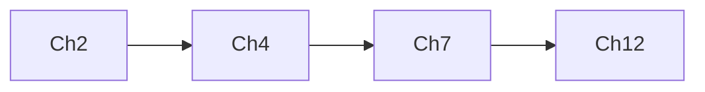

## What I do

- Accept a book or long document in any common format (`.txt`, `.md`, `.pdf`, `.epub`, or a URL)
- Detect and list all chapters
- Read each chapter one at a time (never the whole file at once)
- Systematically extract **every examinable primitive** from each chapter using a universal taxonomy that works for any discipline (CS, Biology, Math, Physics, Chemistry, Medicine, Engineering, Law, History, etc.)
- Produce a single short Markdown cram sheet that covers: definitions, procedures/algorithms/pathways, formulas, classifications/comparisons, rules/laws/theorems, data structures, proof/argument patterns, design paradigms (DP, greedy, CRISPR, PCR), visual diagrams (text), edge cases, evidence, case studies, cross-chapter dependencies, mnemonics, probability & statistics foundation, self-test fill-in templates, ethics, and likely exam questions — every item tagged with a **priority heat map** (HIGH/MEDIUM/LOW) so the student knows where to focus
- Target: readable in 20–30 min the night before an exam

## When to use me

Use this when the user wants the *shortest possible* version of a book that still contains everything a teacher could plausibly test. The output is organized for rapid lookup, not narrative reading.

Trigger phrases:
- "cram this book", "night before exam notes", "exam cram"
- "cheat sheet from <book>", "study guide for tomorrow"
- "compress this to one page", "ultra short summary"
- "give me the must-knows from <book>"

Do **not** use this when the user wants a deep, faithful summary or a full book report.

## Input

Ask the user to clarify only if the source is ambiguous. Default to: "Point me at the book (path or URL), tell me the subject, and the exam format (MCQ / short answer / essay / problem-solving / mixed) if you know it."

- **Subject** determines extraction bias (see Domain Heuristics below).
- **Exam format** adjusts how exam questions are written (MCQ → include distractors; problem-solving → include trace-through problems).

If they provide no path, ask once. Never invent book content.

## Workflow

### Step 1 — Acquire the book

| Source | Action |
|---|---|
| `.txt` / `.md` | Read directly with offset/limit |
| `.pdf` | Use the `pdf` skill to extract text, or `python3 -c "from pypdf import PdfReader; print('\\n'.join(p.extract_text() for p in PdfReader('file.pdf').pages))"` |
| `.epub` | `python3 -c "import ebooklib, bs4; from ebooklib import epub; b=epub.read_epub('file.epub'); [print(c.get_content().decode() if isinstance(c.get_content(),bytes) else c.get_content()) for c in b.get_items_of_type(ebooklib.ITEM_DOCUMENT)]"` then strip HTML |
| URL | `curl -sL <url> \| python3 -c "import sys,re; print(re.sub(r'<[^>]+>',' ',sys.stdin.read()))"` |

Save the cleaned text next to the original as `<book>.clean.txt` for reuse.

### Step 2 — Map the structure

Scan the first ~500 lines to find the table of contents or chapter headings. Build a chapter index: `[(number, title, start_line, end_line)]`. If the book has no detectable chapters, fall back to splitting into 10–15 equal parts.

Build a preliminary **cross-chapter dependency map** by noting forward references as you scan.

### Step 3 — Confirm scope with the user

If the book has >20 chapters, ask which subset to prioritize (whole book, exam-relevant sections, or last-N chapters).

### Step 4 — Read and extract from each chapter (universal checklist)

For each chapter:
1. Extract the slice with offset/limit
2. Run the **universal extraction checklist** below. **Check every category.** If a category has zero content in that chapter, skip it. This systematic sweep ensures nothing examinable is missed.
3. Tag every extracted item with its **priority** (HIGH / MEDIUM / LOW) based on the heat map signals below
4. Drop examples, anecdotes, and repetition
5. Note any cross-chapter links discovered

#### Universal Extraction Checklist

| # | Primitive | What to look for | Applies to |
|---|-----------|------------------|------------|
| 1 | **Named Entities** | Terms, concepts, phenomena, species, organelles, compounds, diseases, algorithms, data structures, protocols — any named thing with a definition | All domains |
| 2 | **Sequential Processes** | Step-by-step procedures: algorithms, metabolic pathways, signaling cascades, protocols, methods, workflows, cycles (Krebs, cell cycle, fetch-decode-execute) | CS, Bio, Chem, Medicine, Engineering |
| 3 | **Hierarchies / Classifications** | Taxonomies, type systems, categorization schemes, complexity classes, Linnaean ranks, disease classifications, protein families | All domains |
| 4 | **Comparisons / Trade-offs** | A vs B, pros/cons, before/after, strengths/weaknesses — anything that contrasts two or more things | All domains |
| 5 | **Formulas & Equations** | Mathematical expressions, statistical tests, chemical equations, Big-O bounds, reaction rate laws, Hardy-Weinberg, enzyme kinetics | CS, Math, Physics, Chem, Bio, Engineering |
| 6 | **Rules, Laws & Theorems** | Named principles: laws, theorems, rules of thumb, design principles, biological laws (Mendel, Hardy-Weinberg), legal doctrines | All domains |
| 7 | **Data Structures & Types** (CS-specific section) | Properties, supported operations, time/space complexity, trade-offs, when to use each | CS |
| 8 | **Visual Patterns** (text-described) | Diagrams, graphs, charts, pathways, architectures, cycles — describe them in text so they can be re-drawn from memory | All domains (critical for Bio pathways, CS graphs, Engineering diagrams) |
| 9 | **Edge Cases / Exceptions / Traps** | Gotchas, degenerate inputs, worst-case scenarios, atypical presentations, contraindications, non-examples | All domains |
| 10 | **Empirical Evidence / Key Results** | Experimental findings, benchmark results, case studies, statistical significance, key experiments | CS (benchmarks), Bio/Chem (experiments), Medicine (trials) |
| 11 | **Cross-Chapter Dependencies** | "This requires Ch X", "as we saw in Ch Y", forward references | All domains |
| 12 | **Dates & People** | Discoverers, inventors, landmark dates, historical context | All domains (critical for History, Medicine, CS pioneers) |
| 13 | **Proof & Argument Patterns** | Induction, contradiction, loop invariants, exchange argument, greedy stays ahead, reduction, experimental reasoning (controls, variables, statistical significance), phylogenetic inference | CS, Math, Bio, Medicine |
| 14 | **Design Paradigms / Meta-Methods** | Cross-cutting methodologies: divide & conquer, dynamic programming, greedy, backtracking, branch & bound (CS); PCR, gel electrophoresis, Western blot, CRISPR, sequencing (Bio); any reusable technique referenced across multiple chapters | CS, Bio, Chem, Medicine, Engineering |
| 15 | **Case Studies / Classic Examples** | Famous named experiments or systems: Mendel's peas, Meselson-Stahl, Hershey-Chase, HeLa cells, Pavlov's dogs (Bio); Turing test, CAP theorem, Winograd schema, Peter Principle, HeLa of CS (CS); landmark legal cases (Law) | All domains |
| 16 | **Ethics & Professional Practice** | AI ethics principles, animal testing guidelines, informed consent, CRISPR ethics, data privacy, dual-use concerns, professional codes of conduct | CS, Bio, Medicine, Engineering, Law |

#### Priority Heat Map

Within each extraction category, tag every item with an **exam priority** based on signal strength:

| Signal | Tag |
|--------|-----|
| Repeated across multiple chapters, framed as "important"/"key"/"remember", appears in bold, in a summary box, or is a section heading | **HIGH** |
| Mentioned once with moderate emphasis, or clearly background knowledge | MEDIUM |
| Peripheral example, anecdote, historical curiosity, footnote | LOW |

Example: `- **Bayes' theorem** (HIGH): P(A\|B) = P(B\|A)P(A)/P(B)` — tag as HIGH if the author devotes a whole section to it and references it later.

Target: each chapter compresses to **8–20 bullets** or roughly **300–600 words**. Dense chapters get more. Thin chapters get fewer. Prefer structured formats over prose.

### Step 5 — Write the cram sheet

Save as `cram-notes-<book-title>-<YYYY-MM-DD>.md` with this template. **Include every section that has content.** Reorder sections so the most content-heavy ones come first. Skip empty sections entirely.

```markdown
# Cram Notes: <Book Title>

> Generated <date>. Subject: <domain>. Exam format: <format>. Read time: ~20–30 min.

## Top 20 Must-Knows
1. ...
2. ...

---

## 1. Sequential Processes (Algorithms / Pathways / Cycles / Protocols)

### <Name>
- **Type**: Algorithm / Pathway / Cycle / Protocol / Workflow
- **Goal**: ...
- **Steps**: (1) ... (2) ... (3) ... (N) ...
- **Input**: ... **Output**: ...
- **Conditions / Invariants**: ...
- **Complexity** (if applicable): Time O(?) Space O(?)
- **Edge Cases**: ...

### <Next Process>
- ...

---

## 2. Design Paradigms & Meta-Methods

### <Paradigm Name>
- **Type**: Algorithmic paradigm / Lab technique / Design pattern
- **Core idea**: ...
- **When to apply** (decision rule): ...
- **Classic examples**: ...
- **Trade-offs / Limitations**: ...
- **Relation to other paradigms**: ...

---

## 3. Classifications & Comparisons

### Hierarchies
- <Root>
  - <Level 1>
    - <Level 2> ...

### Comparisons
| Dimension | A | B |
|---|---|---|
| Property | value | value |

---

## 4. Formulas & Equations

### <Name>
`equation`
- *var* = definition [units]
- *var* = definition [units]
- **When to use**: ...
- **Constraints**: ...

---

## 5. Probability & Statistics Foundation

### Distributions
| Distribution | Parameters | Mean | Variance | Use when |
|---|---|---|---|---|
| Normal | μ, σ² | μ | σ² | ... |
| Binomial | n, p | np | np(1-p) | ... |

### Statistical Tests
| Test | What it checks | When to use | Assumptions |
|---|---|---|---|
| t-test | difference in means | 2 groups, small n | normality, equal variance |
| ANOVA | difference in ≥3 means | ≥3 groups | normality, equal variance |
| Chi-square | independence / fit | categorical data | expected ≥5 per cell |

### Key Concepts
- **p-value**: probability of observed data (or more extreme) given H₀ true. Threshold: typically 0.05
- **Bayes' rule**: P(A\|B) = P(B\|A)P(A) / P(B)
- **MLE**: find parameters that maximize likelihood of observed data
- **Multiple testing correction**: Bonferroni (α/n), FDR (Benjamini-Hochberg) — critical for Bio (GWAS, microarrays)

---

## 6. Rules, Laws & Theorems

### <Name>
- **Priority**: HIGH / MEDIUM / LOW
- **Statement**: ...
- **Conditions**: ...
- **Implications**: ...
- **Proof sketch** (if ≤5 lines): ...
- **Common misapplication**: ...

---

## 7. Proof & Argument Patterns

### <Pattern Name>
- **Domain**: CS / Math / Bio / ...
- **Structure**: (1) ... (2) ... (N) ...
- **When to use**: ...
- **Classic example**: ...
- **Common mistake**: ...

---

## 8. Key Concepts & Glossary (A–Z)

- **Term**: one-line definition
- **Term**: ...

---

## 9. Data Structures  <!-- CS only; omit for other domains -->

| Structure | Operations | Time (avg) | Time (worst) | Space | Use when |
|---|---|---|---|---|---|
| Array | read/write | O(1) | O(1) | O(n) | ... |

---

## 10. Visual Reference (Text Diagrams)

### <Diagram/Cycle/Architecture Name>
```
         ┌─────┐     ┌─────┐
Input → │  A  │ →  │  B  │ → Output
         └─────┘     └─────┘
           │            │
           ▼            ▼
         Side A       Side B
```
- **Key labels**: ...
- **Flow direction**: ...
- **Critical junctions**: ...

---

## 11. Case Studies

### <Name>
- **Priority**: HIGH / MEDIUM / LOW
- **Domain**: ...
- **What**: ...
- **Why it matters**: ...
- **Key takeaway**: ...
- **What to know for exam**: ...

---

## 12. Common Pitfalls & Edge Cases

- ❗ **Priority**: HIGH / MEDIUM / LOW
- **Situation**: ... **Why it traps**: ... **Fix**: ...

---

## 13. Empirical Evidence & Key Results

- **Priority**: HIGH / MEDIUM / LOW
- **Finding**: ... **Method**: ... **Significance**: ...

---

## 14. Cross-Chapter Dependencies


  Or text: `Ch 2 → Ch 4 → Ch 7 → Ch 12`

---

## 15. Ethics & Professional Practice

- **Topic**: ... **Key principle**: ... **Example scenario**: ... **Exam angle**: ...

---

## 16. Mnemonics & Memory Aids

- **<Hard list>**: Acronym: `...` → expansion
- **<Recurring pattern>**: "When X happens, remember Y because Z"
- **<Rhyme or chunk>**: ...

---

## 17. People & Dates

- **Person** (Year–Year): contribution

---

## 18. Self-Test Templates

Fill in the blanks / trace the steps from memory:

### <Process/Algorithm Name> (≥5 steps)
```
Step 1: _____ → _____
Step 2: _____ → _____
...
```
- **Check your answer**: [refer to section 1]

---

## 19. Exam Questions

### MCQ
1. **Q:** ...  **A:** ...  **Distractor:** ... (why wrong)
2. **Q:** ...  **A:** ...  **Distractor:** ...

### Short Answer
1. **Q:** ...  **Rubric:** point 1, point 2, point 3

### Trace / Apply
1. **Input:** ... **Apply <algorithm/process>** → **Expected output:** ... **Why:** ...

### Diagram Label
1. **Diagram:** <text description> **Label:** element A, element B, element C
```

### Step 6 — Verify before saving

Re-read the output and check:
- Is every chapter covered? (count must match the index)
- Were all 16 universal primitives checked against each chapter? (no category skipped without consideration)
- Are all process steps complete (not truncated)?
- Are formulas given with every variable defined plus units/constraints?
- Are comparisons fair (same dimensions used across both sides)?
- Is every extracted item tagged with a priority (HIGH / MEDIUM / LOW)?
- Are design paradigms and meta-methods extracted (if the source covers them across multiple chapters)?
- Are proof/argument patterns captured with structure + classic example?
- Are case studies present with exam-relevant takeaway?
- Is the probability & statistics section present (if the source uses any stats)?
- Are self-test templates present for any process/algorithm with ≥5 steps?
- Are ethics topics captured (if the source covers ethics)?
- Are exam questions formatted per the user's specified exam type?
- Is the total length under ~3000 words? (Tighten the Top-20 and remove redundant glossary entries if over)
- Did you flag any section where the source was unclear?

## Rules

- **Never invent content.** If a chapter is missing or unreadable, say so in the output.
- **Systematic extraction is mandatory.** Run every category in the universal checklist against every chapter. Do not skip categories preemptively — let the content decide.
- **Compress aggressively.** If a process can be 3 steps, don't write 5. If a concept can be one line, don't write two.
- **Preserve the author's framing** for theories, definitions, and named items — paraphrase only connective tissue.
- **Surface exam signals**: repetition, bold text, summary boxes, "key" / "important" / "remember" — these are almost always testable.
- **Generate mnemonics proactively.** If a list of 5+ items must be memorized (e.g., Big-O ordering, Krebs cycle intermediates, Kings of England), invent an acronym, rhyme, or chunk for it.
- **Generate self-test templates for any process/algorithm with ≥5 steps.** Leave blanks for key steps, inputs, or outputs so the student can fill them from memory. Reference the answer location.
- **Capture ethics wherever present.** If the source discusses ethics (AI safety, animal testing, informed consent, dual-use), extract it as a dedicated item — these appear on exams increasingly often.
- **Prioritize technical content** over narrative. A single line of pseudocode or formula is worth more than three lines of explanatory prose.
- **Respect copyright.** Do not reproduce long verbatim passages. Brief quotes (≤25 words) for definitions are fine. Pseudocode and small code snippets (≤15 lines) that are idiomatic/canonical are fine.
- **No filler.** No "in this chapter we learned...". No "as discussed earlier". Just the facts.
- **Structured over prose.** Use lists, tables, ASCII diagrams, and equations. Minimize paragraphs.

## Large book strategy

Books over ~2000 lines must be processed in chunks:
1. **Scan** the first 500 lines to identify structure.
2. **Locate** all chapter headings and their line numbers.
3. **Extract** one chapter at a time using offset/limit.
4. **Discard** chapter text after compression — only the extracted primitive items go into the final file.

This keeps token usage bounded and works for any book length.

## Domain-specific extraction heuristics

When the subject is known, **bias the universal checklist** toward these patterns. The categories themselves stay the same — only the extraction depth per category shifts:

| Domain | Deep-extract these primitives | Light-extract these |
|---|---|---|
| CS / Programming | Sequential Processes (algorithms), Data Structures, Comparisons (trade-offs), Formulas (Big-O), Design Paradigms (DP, greedy, divide & conquer), Proof Patterns (induction, invariants, reductions), Visuals (architectures), Edge Cases, Case Studies | People/Dates, Empirical Evidence, Ethics |
| Biology | Sequential Processes (pathways, cycles), Hierarchies (taxonomies), Comparisons (e.g. mitosis vs meiosis), Visuals (pathway diagrams), Named Entities (species, organelles), Design Paradigms (PCR, CRISPR, sequencing), Case Studies (Mendel, Meselson-Stahl), Mnemonics, Self-Test Templates | Formulas, Edge Cases, Proof Patterns |
| Math | Formulas, Laws/Theorems, Sequential Processes (proof patterns), Proof Patterns (induction, contradiction), Hierarchies (number systems, function classes), Comparisons | People/Dates, Empirical Evidence, Ethics |
| Physics | Formulas, Laws/Theorems, Sequential Processes (derivations), Visuals (free-body, circuits), Edge Cases (limiting behavior), Proof Patterns | People/Dates, Hierarchies, Ethics |
| Chemistry | Formulas (reactions), Sequential Processes (syntheses), Hierarchies (periodic trends), Visuals (mechanisms), Named Entities (compounds), Design Paradigms (spectroscopy, chromatography) | Comparisons, Empirical Evidence, Ethics |
| Medicine | Sequential Processes (pathways, diagnostic algorithms), Hierarchies (disease classifications), Comparisons (differential diagnosis), Edge Cases (atypical presentations), Empirical Evidence (trials), Case Studies, Ethics (informed consent, animal testing) | Formulas, Visuals, Proof Patterns |
| Engineering | Formulas (design equations), Sequential Processes (methods), Comparisons (material trade-offs), Edge Cases (failure modes), Visuals (schematics), Design Paradigms | Named Entities (light), People/Dates, Ethics |
| Law | Rules/Laws/Theorems (doctrines), Hierarchies (court system), Comparisons (burden of proof standards), People/Dates (landmark cases), Edge Cases (exceptions), Case Studies | Formulas, Sequential Processes, Ethics |
| History / Social Sciences | People/Dates, Sequential Processes (causation chains), Comparisons (ideologies, regimes), Hierarchies (government structures), Empirical Evidence (statistics), Case Studies, Ethics | Formulas, Visuals, Proof Patterns |
