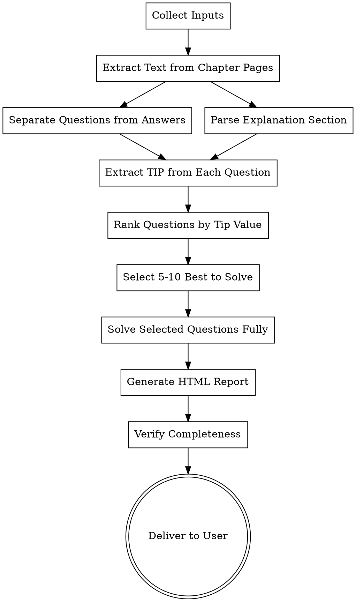

# Exam Prep from PDF

## Overview

**MAIN IDEA:** Read all question tips WITHOUT solving them — then solve only a FEW key questions.

This skill does NOT solve every question. Instead it:
1. **Reads all questions and their answer sheets** — extracts the TIPS, TRICKS, and HIDDEN POINTS from each question's answer
2. **Identifies which questions have valuable tips** — questions that teach you something the textbook doesn't explain
3. **Solves only 5-10 of the most important questions** — the ones with the best tips or most fundamental concepts
4. **Skips questions that are straightforward** — if the answer is just "apply formula X", no tip to learn

**Output:** A curated list of question tips + a few fully solved examples. NOT every question solved.

**Output language: ALL content in the HTML report MUST be written in Persian (فارسی).**

## When to Use

- User has a PDF with questions (exercises) and wants exam preparation materials
- User wants to identify tricky questions before an exam
- User wants to find concepts in answers that the textbook doesn't explain
- User wants a curated list of must-solve basic questions
- User says "analyze this chapter's questions", "exam prep from questions", "find tricky questions"

**Do NOT use when:**
- User wants full study notes (use `cram-notes` instead)
- User wants topic explanations only (use `textbook-to-html` instead)
- PDF contains no questions or answer sheets

## Input Requirements

The user must provide:

| Input | Description | Required |
|-------|-------------|----------|
| **PDF file** | Path to the textbook PDF | Yes |
| **Chapter name** | Name/title of the chapter | Yes |
| **Chapter pages** | Page range containing BOTH questions AND answer sheets (combined) | Yes |
| **Textbook section** | Page range containing the explanation/theory for this chapter | Yes |

**Note:** The chapter pages typically contain questions first, followed by their answer sheets (solutions). Both sections are in the same page range — the agent must parse and separate them internally.

## Workflow



## Phase 1: Extract Content from PDF

### Extract Chapter Pages (Questions + Answers Combined)
```bash
python3 -c "
from pypdf import PdfReader
reader = PdfReader('textbook.pdf')
for i, page_num in enumerate(range(PAGE_START-1, PAGE_END)):
    print(f'=== PAGE {page_num+1} ===')
    print(reader.pages[page_num].extract_text())
" > chapter_extracted.txt
```

### Extract Explanation Section
```bash
python3 -c "
from pypdf import PdfReader
reader = PdfReader('textbook.pdf')
for i, page_num in enumerate(range(EXPLANATION_START-1, EXPLANATION_END)):
    print(f'=== EXPLANATION PAGE {page_num+1} ===')
    print(reader.pages[page_num].extract_text())
" > explanation_extracted.txt
```

**Read both files completely before proceeding.**

### Separate Questions from Answers

The chapter pages contain both questions and their answer sheets. Parse them by detecting structural boundaries:

**Separation signals (look for these patterns):**
- Questions section: numbered items (Q1, Q2, 1., 2., Exercise 3.1), problem statements ending with `?`
- Answer section headers: "Answers", "Solutions", "پاسخ", "جواب", "Answer Key", "Model Answers"
- Answer section: typically starts after all questions, has step-by-step reasoning, final boxed answers

**Strategy:**
1. Scan the full extracted text
2. Find the boundary marker (e.g., "Answers" heading or a page where solution format begins)
3. Split into `questions_text` (before boundary) and `answers_text` (after boundary)
4. If no clear boundary, check each page: pages with problem statements = questions, pages with derivations/final answers = answers

**Read `chapter_extracted.txt` completely and identify:**
- Where questions end
- Where answers begin
- Match each question to its answer by number

## Phase 2: Parse and Structure

### Questions Parser
For each question, extract:
- **Question number** (e.g., Q1, Q2, Exercise 3.1)
- **Full question text** (verbatim)
- **Topic/concept** being tested
- **Difficulty indicators** (multi-step, requires synthesis, uses edge case)

### Answers Parser
For each answer, extract:
- **Question number** (matched to question)
- **Full solution/description** (complete reasoning)
- **Key steps** in the solution
- **Common mistakes** mentioned or implied
- **Formulas/concepts** used

### Explanation Section Parser
For each concept in the explanation, extract:
- **Concept name**
- **Full explanation text**
- **Examples provided**
- **Key formulas/rules stated**
- **Tips or warnings explicitly given**

## Phase 3: Extract Tips from Each Question (DO NOT SOLVE YET)

**For EVERY question, extract the TIP only — do NOT write a full solution.**

### What is a "Tip"?

A tip is the ONE thing this question teaches you that you wouldn't know from just reading the textbook. It's the insight, trick, trap, or hidden point.

### Tip Extraction Template

For each question, write:

```
سوال N: [متن کوتاه سوال]
نکته: [یک جمله — چه چیزی یاد می‌گیرید از این سوال]
دلیل اهمیت: [چرا این نکته برای امتحان مهم است]
```

### Tip Value Scoring

Rate each tip 1-5 based on how much value it adds beyond the textbook:

| Score | Meaning |
|-------|---------|
| 5 | نکته‌ای که در کتاب نیست و اکثر دانشجوها نمی‌دانند |
| 4 | تله رایج که باعث غلط زدن می‌شود |
| 3 | نکته خوب که درک عمیق‌تری می‌دهد |
| 2 | نکته ساده ولی مفید |
| 1 | تکرار مطلب کتاب — ارزش افزوده ندارد |

**Questions with score 1 → SKIP. Do not include in the report.**

### Pre-filter: Skip Textbook-Covered Questions

If a question's answer is just a direct restatement of the textbook explanation with no new tip:
- Score = 1
- Skip it entirely
- Do not include in the tips list or the solved questions

A question is **tricky** if it has ANY of:
- **Counterintuitive answer** - the correct answer contradicts common intuition
- **Common trap** - most students pick a specific wrong answer for a known reason
- **Misread potential** - question wording easily leads to wrong interpretation
- **Exception handling** - the answer depends on an edge case or special condition
- **Multi-concept trap** - requires combining concepts where students typically miss one
- **Notation trap** - uses similar notation for different things, or ambiguous notation
- **Boundary condition** - answer changes at specific boundary values
- **Assumption trap** - correct answer requires noticing an unstated assumption

**Score each tricky indicator:**
- `tricky_score` = count of indicators present (0-8)
- `tricky_reasons` = list of which indicators are present

### 2. Hidden Tips Detection

For each question's answer, compare against the explanation section:

```
For each concept C in answer:
    If C is NOT fully explained in textbook section:
        → This is a HIDDEN TIP
        → Record: concept, where it appears, why it matters
```

**Hidden tip types:**
- **Unstated prerequisite** - knowledge assumed but not taught in this chapter
- **Extended formula** - formula used in answer but not derived in explanation
- **Shortcut method** - efficient approach not covered in theory
- **Real-world application** - practical use not mentioned in textbook
- **Deeper insight** - reasoning that goes beyond surface explanation
- **Cross-topic connection** - links to concepts from other chapters
- **Intuition builder** - mental model not provided in textbook

## Phase 4: Select Best Questions to Solve

After extracting tips from ALL questions, select **5-10 questions** to fully solve.

### Selection Criteria

Pick questions that have:
1. **Tip score 4-5** — highest value tips
2. **Multiple tip types** — e.g., both tricky AND hidden tip
3. **Fundamental concepts** — must-solve for exam preparation
4. **Variety** — cover different topics/concepts from the chapter

### What to Skip

- Questions with tip score 1-2 (straightforward, no new insight)
- Questions that are just "apply formula" with no trick
- Duplicate tips (if two questions teach the same thing, pick the better one)

### Solve Template for Selected Questions

For each selected question, write a FULL solution:

```
سوال N: [متن کامل سوال]

نکته اصلی: [یک جمله — مهم‌ترین چیزی که یاد می‌گیرید]

حل کامل:
  مرحله ۱: ...
  مرحله ۲: ...
  مرحله ۳: ...

اشتباه رایج: [چه اشتباهی دانشجوها می‌کنند]

نکته حفظی: [چیزی که باید حفظ کنید]
```

## Phase 5: Generate HTML Report

### HTML Structure

The HTML has TWO main sections:
1. **لیست نکات** — all question tips (quick overview, no full solutions)
2. **سوالات حل شده** — 5-10 fully solved questions

```html
<!DOCTYPE html>
<html lang="fa" dir="rtl">
<head>
    <meta charset="UTF-8">
    <meta name="viewport" content="width=device-width, initial-scale=1.0">
    <title>آمادگی امتحان: [نام فصل]</title>
    <link rel="preconnect" href="https://fonts.googleapis.com">
    <link href="https://fonts.googleapis.com/css2?family=Inter:wght@300;400;500;600;700&family=Plus+Jakarta+Sans:wght@500;600;700&family=Vazirmatn:wght@300;400;500;600;700&display=swap" rel="stylesheet">
    <script src="https://cdn.jsdelivr.net/npm/mathjax@3/es5/tex-mml-chtml.js"></script>
    <style>
        :root {
            --bg: #F8F9FA;
            --card: #FFFFFF;
            --text: #1A1A2E;
            --text-secondary: #4A4A6A;
            --accent: #2563EB;
            --purple: #7C3AED;
            --green: #059669;
            --amber: #D97706;
            --border: #E5E7EB;
            --shadow: 0 1px 3px rgba(0,0,0,0.08), 0 1px 2px rgba(0,0,0,0.06);
            --radius: 12px;
        }
        * { margin: 0; padding: 0; box-sizing: border-box; }
        body {
            font-family: 'Inter', 'Vazirmatn', system-ui, sans-serif;
            background: var(--bg);
            color: var(--text);
            line-height: 1.7;
            padding: 32px;
        }
        h1, h2, h3, h4 {
            font-family: 'Plus Jakarta Sans', 'Vazirmatn', sans-serif;
            font-weight: 600;
        }
        /* Add professional card styles, stats bar, tip badges, solution accordions here */
    </style>
</head>
<body>
    <!-- Header -->
    <!-- لیست نکات (Tips List) -->
    <!-- سوالات حل شده (Solved Questions) -->
</body>
</html>
```

### Required Sections in HTML

#### Section 1: Dashboard Header
```
فصل: [نام فصل]
تعداد کل سوالات: N
نکات استخراج شده: N
سوالات حل شده: 5-10
تاریخ تحلیل: [تاریخ]
```

#### Section 2: لیست نکات (Tips List)
For each question with tip score ≥ 2:
```html
<div class="tip-card">
    <div class="tip-header">
        <span class="tip-score">نکته ۵</span>
        <span class="tip-num">سوال ۳</span>
    </div>
    <div class="tip-question">[متن کوتاه سوال]</div>
    <div class="tip-text">[نکته — یک جمله]</div>
    <div class="tip-why">[چرا مهم است]</div>
</div>
```

#### Section 3: سوالات حل شده (Fully Solved Questions)
For each selected question (5-10 total):
```html
<div class="solved-card">
    <div class="card-header">
        <span class="badge">حل کامل</span>
        <span class="question-num">سوال ۳</span>
    </div>
    <div class="question-text">[متن کامل سوال]</div>
    <div class="main-tip">[نکته اصلی — یک جمله]</div>
    <div class="solution">
        <h4>حل کامل:</h4>
        <ol>
            <li>مرحله ۱: ...</li>
            <li>مرحله ۲: ...</li>
            <li>مرحله ۳: ...</li>
        </ol>
    </div>
    <div class="common-mistake">[اشتباه رایج]</div>
    <div class="memorize">[نکته حفظی]</div>
</div>
```

### Professional Design Requirements

#### Color Palette (Light Professional Theme)
- **Background:** `#F8F9FA` (soft gray-white)
- **Card Background:** `#FFFFFF` (pure white)
- **Primary Text:** `#1A1A2E` (dark navy)
- **Secondary Text:** `#4A4A6A` (muted purple-gray)
- **Accent Primary:** `#2563EB` (professional blue)
- **Accent Secondary:** `#7C3AED` (refined purple)
- **Success/Score 5:** `#059669` (emerald green)
- **Warning/Score 4:** `#D97706` (amber)
- **Info/Score 3:** `#2563EB` (blue)
- **Border:** `#E5E7EB` (light gray)
- **Shadow:** `0 1px 3px rgba(0,0,0,0.08), 0 1px 2px rgba(0,0,0,0.06)`

#### Typography
- **Primary Font:** `'Inter', 'Vazirmatn', system-ui, sans-serif` (Google Fonts Inter + Vazirmatn for Persian)
- **Heading Font:** `'Plus Jakarta Sans', 'Vazirmatn', sans-serif`
- **Monospace:** `'JetBrains Mono', 'Fira Code', monospace`
- Load from Google Fonts: `<link href="https://fonts.googleapis.com/css2?family=Inter:wght@300;400;500;600;700&family=Plus+Jakarta+Sans:wght@500;600;700&family=Vazirmatn:wght@300;400;500;600;700&display=swap" rel="stylesheet">`

#### Math Notation Support
- Use **MathJax 3** for LaTeX math rendering
- Load: `<script src="https://cdn.jsdelivr.net/npm/mathjax@3/es5/tex-mml-chtml.js"></script>`
- Wrap all math in `\(...\)` for inline and `\[...\]` for display mode
- In solutions, always render formulas with proper notation

#### Design Elements
1. **Clean Card Layout** - white cards with subtle shadows, rounded corners (12px)
2. **Color-Coded Tip Badges** - emerald for score 5, amber for score 4, blue for score 3
3. **Subtle Hover Effects** - smooth shadow transition on card hover (no neon/glow)
4. **Collapsible Solutions** - clean accordion with smooth expand/collapse animation
5. **Search/Filter Bar** - minimal input with icon, filter by tip score
6. **Print Mode** - clean layout with no shadows, optimized margins
7. **Statistics Summary** - clean horizontal stat cards at top
8. **Professional Spacing** - generous padding (24px cards, 16px gaps), clear visual hierarchy
9. **RTL Support** - full right-to-left layout for Persian content
10. **Subtle Dividers** - thin `1px solid #E5E7EB` lines between sections

## Phase 5: Iterative Extraction — Second Pass (MANDATORY)

**After generating the first HTML report, do NOT deliver yet. Run this review pass.**

### Why Iterate?

The first pass may miss:
- Questions buried in dense text or unusual formatting
- Questions that span across pages without clear numbering
- Subtle tricky questions that only become apparent after full analysis
- Questions where the answer reveals a hidden tip not caught initially
- Basic questions that are phrased unusually

### Review Checklist

Ask yourself for EVERY question in the chapter:

```
□ Did I analyze ALL questions? Count them.
  - Count questions found: ___
  - Count expected (from scanning pages): ___
  - If mismatch → find the missing ones

□ Did I exclude questions fully covered by the textbook explanation?
  - For each included question: does it add value beyond the textbook?
  - If answer is just "see section X" with no extra insight → exclude

□ Are there questions I skipped because they seemed "too easy"?
  - Re-evaluate: even easy questions may be basic must-solve

□ Did I miss any questions where the answer references a concept
  not in the explanation section?
  - These are HIDDEN TIPS — re-scan answers for unfamiliar terms

□ Are there question groups (a, b, c sub-parts)?
  - Each sub-part may be independently tricky/basic

□ Did I check for questions in unusual formats?
  - True/False, Fill-in-blank, Multiple choice
  - Diagram-based questions (describe the diagram in text)
  - Proof/derivation questions
```

### Second Pass Extraction

If ANY gaps found:

```bash
python3 -c "
from pypdf import PdfReader
reader = PdfReader('textbook.pdf')
# Re-extract with focus on missed sections
for i, page_num in enumerate(range(PAGE_START-1, PAGE_END)):
    text = reader.pages[page_num].extract_text()
    print(f'=== PAGE {page_num+1} ===')
    print(text)
" > chapter_extracted_pass2.txt
```

**Compare Pass 1 and Pass 2:**
1. Read `chapter_extracted.txt` side-by-side with `chapter_extracted_pass2.txt`
2. Find any question present in Pass 2 but missing from Pass 1 analysis
3. For each missed question, run the full analysis (tricky/hidden/basic detection)
4. Apply the pre-filter: exclude if fully covered by textbook explanation
5. Add qualifying questions to the HTML report

### Merge & Deduplicate

After second pass:
1. Combine all questions from Pass 1 and Pass 2
2. Remove duplicates (same question number or identical text)
3. Verify: every question number from the chapter appears exactly once
4. Update statistics in the HTML header

### Loop Until Complete

**Repeat the review if:**
- Second pass found new questions → run third pass review
- More than 3 questions were missed in first pass → thoroughness issue
- Any answer references a concept not yet analyzed

**Stop iterating when:**
- Question count from analysis matches question count from pages (±0)
- Every question has been classified (tricky/hidden/basic/none)
- No new questions found in the review pass

**Maximum iterations: 3.** If after 3 passes you still find missed questions, note them in the HTML as "⚠️ Possibly incomplete — verify with original PDF."

## Phase 6: Final Verification Checklist

Before delivering, verify:

- [ ] Every question from the chapter has a tip extracted (score ≥ 2)
- [ ] Questions with score 1 are excluded (no value beyond textbook)
- [ ] 5-10 questions are fully solved (best tips, most fundamental)
- [ ] All solved questions have: full solution, main tip, common mistake, memorize item
- [ ] HTML renders correctly in browser
- [ ] All interactive elements work (expand/collapse, filter)
- [ ] Statistics match actual counts
- [ ] Second pass review completed (even if no new questions found)

## Rules

- **ALL output in Persian (فارسی).** Every label, header, reason, solution, insight, and UI text in the HTML must be in Persian.
- **Professional light theme only.** Use the specified color palette — white cards, soft gray background, no dark themes.
- **Use MathJax for all math.** Every formula, equation, and mathematical expression must be wrapped in `\(...\)` or `\[...\]` for proper rendering.
- **Load Google Fonts.** Always include Inter + Vazirmatn + Plus Jakarta Sans via Google Fonts CDN.
- **DO NOT solve every question.** Extract tips from ALL questions, but solve only 5-10 of the best ones.
- **Be specific with tips.** "نکته خوب" کافی نیست — توضیح دهید چه چیزی یاد می‌گیرید.
- **Include full solutions for selected questions only.** نگویید "به پاسخ نگاه کنید" — کامل حل کنید.
- **Skip textbook-covered questions.** If the answer just restates the textbook with no new tip, exclude it.
- **Iterate until complete.** Always run the second pass review. If you missed questions, do a third pass.
- **Clean, readable design.** Professional typography, generous spacing, subtle shadows — no flashy effects.
- **Print-friendly.** Ensure the HTML prints cleanly for offline study.
- **Mobile responsive.** Must work on phones for studying on the go.

## Example Usage

```
User: "Analyze chapter 3 from data-structures.pdf"
User: "Chapter name: Linked Lists"
User: "Chapter pages: 45-52 (has both questions and answers)"
User: "Explanation section: 38-44"

Agent:
1. Extract pages 45-52 → chapter_extracted.txt
2. Separate questions from answers within the text
3. Extract explanation from pages 38-44 → explanation_extracted.txt
4. Extract tip from each question (DO NOT solve yet)
5. Score tips: 15 questions with score ≥ 2, 8 questions with score 1 (excluded)
6. Select 7 best questions to fully solve (scores 4-5, variety of topics)
7. Generate linked-lists-exam-prep.html with tips list + solved questions
8. Review pass: found 2 missed questions in page 49
9. Pass 2: extract tips for 2 more, 1 has score 4 → add to solved list
10. Final: 17 tips in list, 8 questions fully solved
11. Deliver: "آمادگی امتحان لینک: ۱۷ نکته + ۸ سوال حل شده"
```

## File Naming

`[chapter-name]-exam-prep.html`

Examples:
- `linked-lists-exam-prep.html`
- `binary-trees-exam-prep.html`
- `graph-algorithms-exam-prep.html`

## Integration

- Use with `cram-notes` for comprehensive study notes
- Use with `textbook-to-html` for topic explanations
- Use with `algorithm-animation` for interactive algorithm demos
