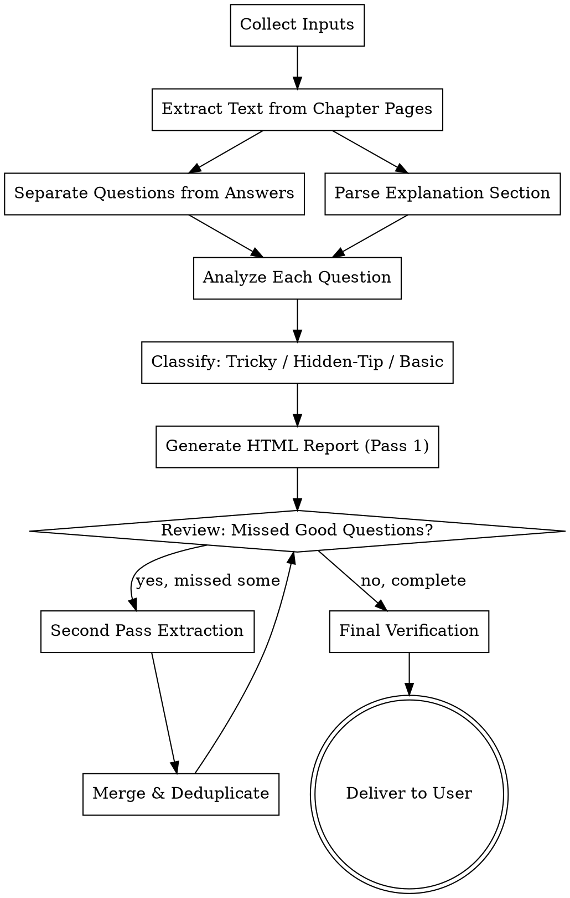

# Exam Prep from PDF

## Overview

Analyzes PDF textbook chapters by cross-referencing questions with their answer sheets and the textbook explanation section. Identifies three categories of study material:
1. **Tricky Questions** - questions with common traps, counterintuitive answers, or frequently misunderstood concepts
2. **Hidden Tips & Points** - important concepts in answers that are NOT explained in the textbook section
3. **Basic Questions** - fundamental questions every student must solve for the chapter

Outputs everything in a visually creative, interactive HTML file.

## When to Use

- User has a PDF with questions (exercises) and wants exam preparation materials
- User wants to identify tricky questions before an exam
- User wants to find concepts in answers that the textbook doesn't explain
- User wants a curated list of must-solve basic questions
- User says "analyze this chapter's questions", "exam prep from questions", "find tricky questions"

**Do NOT use when:**
- User wants full study notes (use `cram-notes` instead)
- User wants topic explanations only (use `textbook-to-html` instead)
- PDF contains no questions or answer sheets

## Input Requirements

The user must provide:

| Input | Description | Required |
|-------|-------------|----------|
| **PDF file** | Path to the textbook PDF | Yes |
| **Chapter name** | Name/title of the chapter | Yes |
| **Chapter pages** | Page range containing BOTH questions AND answer sheets (combined) | Yes |
| **Textbook section** | Page range containing the explanation/theory for this chapter | Yes |

**Note:** The chapter pages typically contain questions first, followed by their answer sheets (solutions). Both sections are in the same page range — the agent must parse and separate them internally.

## Workflow



## Phase 1: Extract Content from PDF

### Extract Chapter Pages (Questions + Answers Combined)
```bash
python3 -c "
from pypdf import PdfReader
reader = PdfReader('textbook.pdf')
for i, page_num in enumerate(range(PAGE_START-1, PAGE_END)):
    print(f'=== PAGE {page_num+1} ===')
    print(reader.pages[page_num].extract_text())
" > chapter_extracted.txt
```

### Extract Explanation Section
```bash
python3 -c "
from pypdf import PdfReader
reader = PdfReader('textbook.pdf')
for i, page_num in enumerate(range(EXPLANATION_START-1, EXPLANATION_END)):
    print(f'=== EXPLANATION PAGE {page_num+1} ===')
    print(reader.pages[page_num].extract_text())
" > explanation_extracted.txt
```

**Read both files completely before proceeding.**

### Separate Questions from Answers

The chapter pages contain both questions and their answer sheets. Parse them by detecting structural boundaries:

**Separation signals (look for these patterns):**
- Questions section: numbered items (Q1, Q2, 1., 2., Exercise 3.1), problem statements ending with `?`
- Answer section headers: "Answers", "Solutions", "پاسخ", "جواب", "Answer Key", "Model Answers"
- Answer section: typically starts after all questions, has step-by-step reasoning, final boxed answers

**Strategy:**
1. Scan the full extracted text
2. Find the boundary marker (e.g., "Answers" heading or a page where solution format begins)
3. Split into `questions_text` (before boundary) and `answers_text` (after boundary)
4. If no clear boundary, check each page: pages with problem statements = questions, pages with derivations/final answers = answers

**Read `chapter_extracted.txt` completely and identify:**
- Where questions end
- Where answers begin
- Match each question to its answer by number

## Phase 2: Parse and Structure

### Questions Parser
For each question, extract:
- **Question number** (e.g., Q1, Q2, Exercise 3.1)
- **Full question text** (verbatim)
- **Topic/concept** being tested
- **Difficulty indicators** (multi-step, requires synthesis, uses edge case)

### Answers Parser
For each answer, extract:
- **Question number** (matched to question)
- **Full solution/description** (complete reasoning)
- **Key steps** in the solution
- **Common mistakes** mentioned or implied
- **Formulas/concepts** used

### Explanation Section Parser
For each concept in the explanation, extract:
- **Concept name**
- **Full explanation text**
- **Examples provided**
- **Key formulas/rules stated**
- **Tips or warnings explicitly given**

## Phase 3: Analyze Each Question

For EVERY question, perform this analysis:

### 1. Tricky Question Detection

A question is **tricky** if it has ANY of:
- **Counterintuitive answer** - the correct answer contradicts common intuition
- **Common trap** - most students pick a specific wrong answer for a known reason
- **Misread potential** - question wording easily leads to wrong interpretation
- **Exception handling** - the answer depends on an edge case or special condition
- **Multi-concept trap** - requires combining concepts where students typically miss one
- **Notation trap** - uses similar notation for different things, or ambiguous notation
- **Boundary condition** - answer changes at specific boundary values
- **Assumption trap** - correct answer requires noticing an unstated assumption

**Score each tricky indicator:**
- `tricky_score` = count of indicators present (0-8)
- `tricky_reasons` = list of which indicators are present

### 2. Hidden Tips Detection

For each question's answer, compare against the explanation section:

```
For each concept C in answer:
    If C is NOT fully explained in textbook section:
        → This is a HIDDEN TIP
        → Record: concept, where it appears, why it matters
```

**Hidden tip types:**
- **Unstated prerequisite** - knowledge assumed but not taught in this chapter
- **Extended formula** - formula used in answer but not derived in explanation
- **Shortcut method** - efficient approach not covered in theory
- **Real-world application** - practical use not mentioned in textbook
- **Deeper insight** - reasoning that goes beyond surface explanation
- **Cross-topic connection** - links to concepts from other chapters
- **Intuition builder** - mental model not provided in textbook

### 3. Basic Question Detection

A question is **basic** (must-solve) if it:
- Tests a core concept that appears in >50% of exam patterns
- Is explicitly labeled as fundamental/important in the textbook
- Has a straightforward solution using only chapter's main formulas
- Is a prerequisite for understanding harder questions in the chapter
- Tests a definition, formula, or process that must be memorized
- Appears in multiple past exams or is referenced as "classic"

**Score basic importance:**
- `basic_score` = 1-5 scale (5 = absolutely must solve)
- `basic_reasons` = why this is fundamental

## Phase 4: Generate HTML Report

### HTML Structure

```html
<!DOCTYPE html>
<html lang="en">
<head>
    <meta charset="UTF-8">
    <meta name="viewport" content="width=device-width, initial-scale=1.0">
    <title>Exam Prep: [Chapter Name]</title>
    <style>
        /* Creative dark theme with neon accents */
        :root {
            --bg-primary: #0a0a1a;
            --bg-secondary: #12122a;
            --bg-card: #1a1a3a;
            --text-primary: #e0e0ff;
            --text-secondary: #8888aa;
            --accent-tricky: #ff4466;
            --accent-hidden: #44ff88;
            --accent-basic: #4488ff;
            --accent-gold: #ffaa00;
            --glow-tricky: 0 0 20px rgba(255,68,102,0.3);
            --glow-hidden: 0 0 20px rgba(68,255,136,0.3);
            --glow-basic: 0 0 20px rgba(68,136,255,0.3);
        }
        /* ... full CSS ... */
    </style>
</head>
<body>
    <!-- Header with chapter stats -->
    <!-- Tab navigation: Tricky | Hidden Tips | Basic | All Questions -->
    <!-- Question cards with expandable details -->
    <!-- Summary statistics -->
</body>
</html>
```

### Creative Design Elements

1. **Animated Background** - subtle particle effect or gradient animation
2. **Color-Coded Cards** - red for tricky, green for hidden tips, blue for basic
3. **Glowing Borders** - neon glow effect on hover for each category
4. **Progress Tracker** - visual checklist of questions analyzed
5. **Difficulty Meter** - animated gauge showing tricky_score
6. **Collapsible Sections** - click to expand question details
7. **Search/Filter** - filter by category, difficulty, topic
8. **Print Mode** - clean layout for printing
9. **Dark/Light Toggle** - theme switcher
10. **Statistics Dashboard** - pie chart of question categories

### Required Sections in HTML

#### Section 1: Dashboard Header
```
Chapter: [Name]
Total Questions: N
Tricky: N (XX%)
Hidden Tips: N
Basic Must-Solve: N
Analysis Date: [Date]
```

#### Section 2: Tricky Questions (Red Theme)
For each tricky question:
```html
<div class="question-card tricky">
    <div class="card-header">
        <span class="badge">TRICKY</span>
        <span class="difficulty">Difficulty: ●●●○○</span>
        <span class="question-num">Q3</span>
    </div>
    <div class="question-text">
        [Full question text]
    </div>
    <div class="tricky-reasons">
        <h4>Why This Is Tricky:</h4>
        <ul>
            <li>Counterintuitive answer</li>
            <li>Common trap: most students pick B</li>
        </ul>
    </div>
    <div class="answer-walkthrough">
        <h4>Full Solution:</h4>
        [Complete step-by-step solution]
    </div>
    <div class="key-insight">
        <h4>Key Insight:</h4>
        [The one thing to remember]
    </div>
</div>
```

#### Section 3: Hidden Tips (Green Theme)
For each hidden tip:
```html
<div class="question-card hidden-tip">
    <div class="card-header">
        <span class="badge">HIDDEN TIP</span>
        <span class="tip-type">Unstated Prerequisite</span>
    </div>
    <div class="tip-content">
        <h4>What the textbook doesn't explain:</h4>
        [Concept not in explanation section]
    </div>
    <div class="appears-in">
        <h4>Appears in these questions:</h4>
        <span class="question-ref">Q5, Q12, Q18</span>
    </div>
    <div class="why-it-matters">
        <h4>Why This Matters:</h4>
        [Why you need to know this]
    </div>
</div>
```

#### Section 4: Basic Must-Solve (Blue Theme)
For each basic question:
```html
<div class="question-card basic">
    <div class="card-header">
        <span class="badge">BASIC - MUST SOLVE</span>
        <span class="importance">Importance: ★★★★★</span>
    </div>
    <div class="question-text">
        [Full question text]
    </div>
    <div class="why-basic">
        <h4>Why This Is Fundamental:</h4>
        [Reason it's a must-solve]
    </div>
    <div class="solution">
        <h4>Solution:</h4>
        [Step-by-step solution]
    </div>
    <div class="memorize">
        <h4>Memorize This:</h4>
        [Key formula or concept to memorize]
    </div>
</div>
```

#### Section 5: Statistics & Summary
```html
<div class="stats-dashboard">
    <div class="stat-card">
        <div class="stat-number">12</div>
        <div class="stat-label">Tricky Questions</div>
    </div>
    <div class="stat-card">
        <div class="stat-number">8</div>
        <div class="stat-label">Hidden Tips</div>
    </div>
    <div class="stat-card">
        <div class="stat-number">15</div>
        <div class="stat-label">Basic Must-Solve</div>
    </div>
</div>
```

## Phase 5: Iterative Extraction — Second Pass (MANDATORY)

**After generating the first HTML report, do NOT deliver yet. Run this review pass.**

### Why Iterate?

The first pass may miss:
- Questions buried in dense text or unusual formatting
- Questions that span across pages without clear numbering
- Subtle tricky questions that only become apparent after full analysis
- Questions where the answer reveals a hidden tip not caught initially
- Basic questions that are phrased unusually

### Review Checklist

Ask yourself for EVERY question in the chapter:

```
□ Did I analyze ALL questions? Count them.
  - Count questions found: ___
  - Count expected (from scanning pages): ___
  - If mismatch → find the missing ones

□ Are there questions I skipped because they seemed "too easy"?
  - Re-evaluate: even easy questions may be basic must-solve

□ Did I miss any questions where the answer references a concept
  not in the explanation section?
  - These are HIDDEN TIPS — re-scan answers for unfamiliar terms

□ Are there question groups (a, b, c sub-parts)?
  - Each sub-part may be independently tricky/basic

□ Did I check for questions in unusual formats?
  - True/False, Fill-in-blank, Multiple choice
  - Diagram-based questions (describe the diagram in text)
  - Proof/derivation questions
```

### Second Pass Extraction

If ANY gaps found:

```bash
python3 -c "
from pypdf import PdfReader
reader = PdfReader('textbook.pdf')
# Re-extract with focus on missed sections
for i, page_num in enumerate(range(PAGE_START-1, PAGE_END)):
    text = reader.pages[page_num].extract_text()
    print(f'=== PAGE {page_num+1} ===')
    print(text)
" > chapter_extracted_pass2.txt
```

**Compare Pass 1 and Pass 2:**
1. Read `chapter_extracted.txt` side-by-side with `chapter_extracted_pass2.txt`
2. Find any question present in Pass 2 but missing from Pass 1 analysis
3. For each missed question, run the full analysis (tricky/hidden/basic detection)
4. Add to the HTML report

### Merge & Deduplicate

After second pass:
1. Combine all questions from Pass 1 and Pass 2
2. Remove duplicates (same question number or identical text)
3. Verify: every question number from the chapter appears exactly once
4. Update statistics in the HTML header

### Loop Until Complete

**Repeat the review if:**
- Second pass found new questions → run third pass review
- More than 3 questions were missed in first pass → thoroughness issue
- Any answer references a concept not yet analyzed

**Stop iterating when:**
- Question count from analysis matches question count from pages (±0)
- Every question has been classified (tricky/hidden/basic/none)
- No new questions found in the review pass

**Maximum iterations: 3.** If after 3 passes you still find missed questions, note them in the HTML as "⚠️ Possibly incomplete — verify with original PDF."

## Phase 6: Final Verification Checklist

Before delivering, verify:

- [ ] Every question from the chapter is analyzed
- [ ] Question count matches: analysis count = page count (±0)
- [ ] Every tricky question has: question text, reasons, full solution, key insight
- [ ] Every hidden tip has: concept, which questions it appears in, why it matters
- [ ] Every basic question has: importance rating, solution, memorize-this item
- [ ] HTML renders correctly in browser
- [ ] All interactive elements work (tabs, expand/collapse, filter)
- [ ] Statistics match actual counts
- [ ] No question is left uncategorized
- [ ] Second pass review completed (even if no new questions found)

## Rules

- **Never skip questions.** Analyze EVERY question from the chapter.
- **Be specific with reasons.** "Tricky" is not enough — explain WHY.
- **Include full solutions.** Don't just say "see answer" — write out the complete solution.
- **Cross-reference thoroughly.** Check every answer concept against the explanation section.
- **Iterate until complete.** Always run the second pass review. If you missed questions, do a third pass.
- **Count verification is mandatory.** Compare analysis count vs page count. Mismatch = not done.
- **Creative but readable.** Design should enhance, not distract from content.
- **Print-friendly.** Ensure the HTML prints cleanly for offline study.
- **Mobile responsive.** Must work on phones for studying on the go.

## Example Usage

```
User: "Analyze chapter 3 from data-structures.pdf"
User: "Chapter name: Linked Lists"
User: "Chapter pages: 45-52 (has both questions and answers)"
User: "Explanation section: 38-44"

Agent:
1. Extract pages 45-52 → chapter_extracted.txt
2. Separate questions from answers within the text
3. Extract explanation from pages 38-44 → explanation_extracted.txt
4. Analyze each question against its answer and explanation
5. Pass 1 results: 10 tricky, 6 hidden tips, 14 basic must-solve (30 total)
6. Generate linked-lists-exam-prep.html
7. Review pass: found 2 missed questions in page 49 (sub-parts b,c)
8. Pass 2: added 2 more questions, re-analyzed, updated HTML
9. Final count: 10 tricky, 7 hidden tips, 15 basic must-solve (32 total)
10. Deliver: "Created exam prep with 32 analyzed questions (2 passes)"
```

## File Naming

`[chapter-name]-exam-prep.html`

Examples:
- `linked-lists-exam-prep.html`
- `binary-trees-exam-prep.html`
- `graph-algorithms-exam-prep.html`

## Integration

- Use with `cram-notes` for comprehensive study notes
- Use with `textbook-to-html` for topic explanations
- Use with `algorithm-animation` for interactive algorithm demos
