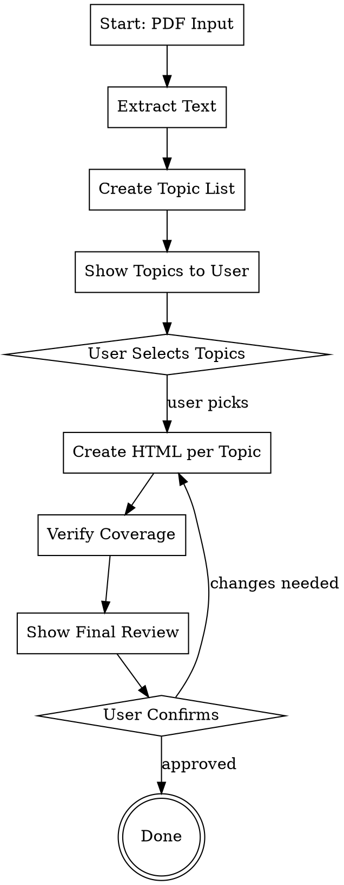

# Textbook to HTML Converter

## Overview

Converts textbook chapters (PDF or extracted text) into comprehensive, interactive HTML learning files optimized for exam preparation. The process loops until every concept is covered with multiple examples.

## When to Use

- User wants to study from a textbook PDF
- User needs comprehensive exam preparation materials
- User wants interactive HTML files with animations
- User wants to ensure no concept is missed

## How to Extract (NOT Copy-Paste)

**IMPORTANT:** Do NOT copy-paste text from the PDF. Extract CONCEPTS and rephrase in English.

### The Rule

1. **Read** the source text (Persian/Arabic/other language)
2. **Understand** the concept being explained
3. **Write** the explanation fresh in English
4. **Keep** formulas exactly as-is (math is universal)
5. **Create** your own examples (don't copy textbook examples)

### Examples

**WRONG (copy-paste):**
```
PDF: "آرایه خطی داده ساختاری است که عناصر آن در حافظه پیوسته ذخیره می شوند"
HTML: "Array linear data structure is that elements it in memory continuous are stored"
```

**RIGHT (extract concept):**
```
PDF: "آرایه خطی داده ساختاری است که عناصر آن در حافظه پیوسته ذخیره می شوند"
HTML: "An array is a linear data structure where elements are stored in contiguous memory locations"
```

### Language Rules

- **HTML content:** Always in English
- **Formulas:** Keep exact notation from textbook
- **Variable names:** Keep as-is (i, j, n, α, etc.)
- **Algorithm names:** Keep as-is (KMP, Binary Search, etc.)

## Core Workflow



## MANDATORY WORKFLOW (Follow Exactly)

**DO NOT skip any phase. DO NOT stop until user confirms final review.**

### Phase 1: Extract Content (MANDATORY)

1. **If PDF:** Use `pypdf` to extract text from specified pages
   ```bash
   python3 -c "
   from pypdf import PdfReader
   reader = PdfReader('textbook.pdf')
   for i, page in enumerate(reader.pages[START:END]):
       print(f'=== PAGE {START+i+1} ===')
       print(page.extract_text())
   " > extracted.txt
   ```

2. **Read the extracted text completely** - DO NOT skim

### Phase 2: Create Topic List (MANDATORY)

Read extracted text and create a numbered list of ALL topics:

```
Found these topics in pages X-Y:

1. [Topic Name] - [Brief description]
2. [Topic Name] - [Brief description]
3. [Topic Name] - [Brief description]
...

Which topics should I create HTML for? (Enter numbers or "all")
```

**Wait for user response before continuing.**

### Phase 3: Create HTML Files (MANDATORY)

For EACH topic user selected, create `[topic-name]-comprehensive.html`

**Extraction Process per Topic:**
1. Read the Persian/Arabic text for this topic
2. Understand the concept
3. Write explanation fresh in English
4. Keep formulas exactly as shown
5. Create 3-5 new examples (don't copy textbook examples)

**Required Elements:**
1. Tabbed navigation
2. ALL formulas with variable definitions (in English)
3. Algorithm pseudocode
4. 3-5 worked examples
5. Comparison tables
6. Time/space complexity
7. Warning boxes for common mistakes

### Phase 4: Coverage Verification (MANDATORY)

1. **Run verification script:**
   ```bash
   python3 verify_coverage.py coverage.txt /path/to/html/files
   ```

2. **Check output** - fix any gaps found

### Phase 5: LOOP Until Complete (MANDATORY)

**RUN verification script. If it shows gaps, DO NOT STOP.**

Loop:
1. Run: `python3 verify_coverage.py coverage.txt .`
2. Find first gap from output
3. Create or update HTML to fix gap
4. Re-run verification script
5. Repeat until output shows "ALL TOPICS COVERED"

### Phase 6: Final Review (MANDATORY)

Show user a summary:

```
=== CONVERSION COMPLETE ===
Source: [filename] pages X-Y

HTML Files Created:
1. [filename].html - [Topic Name]
2. [filename].html - [Topic Name]
...

Statistics:
- Topics covered: N
- Total formulas: N
- Total algorithms: N
- Total examples: N

All files are in: [directory path]

Any changes needed? (yes/no)
```

**Wait for user confirmation before marking complete.**

### Phase 7: Apply Changes (IF NEEDED)

If user requests changes:
1. Make the requested changes
2. Re-run verification
3. Show updated summary
4. Wait for user confirmation again

## Files in This Skill

- `SKILL.md` - This file (workflow and instructions)
- `html-template.html` - Reusable HTML template with styling
- `coverage-template.txt` - Copy this to create coverage.txt tracker
- `verify_coverage.py` - Script to verify coverage automatically

## HTML Template

Use `html-template.html` for consistent styling across all files.

## Quality Checklist

Each HTML file must have:
- [ ] Dark theme with green/orange accents
- [ ] Tabbed navigation for sub-topics
- [ ] All formulas from textbook (with English descriptions)
- [ ] Algorithm pseudocode
- [ ] 3-5 worked examples
- [ ] Comparison tables
- [ ] Time/space complexity
- [ ] Warning boxes for common mistakes
- [ ] Quick reference cards
- [ ] Responsive layout
- [ ] ALL content in English (not copy-pasted from source)

## Common Mistakes to Avoid

1. **Don't copy-paste** - Extract concepts, write fresh in English
2. **Don't skip topics** - Every selected concept must have an HTML
3. **Don't have just one example** - Minimum 3 per concept
4. **Don't forget formulas** - All equations must be included
5. **Don't skip edge cases** - Include special cases
6. **Don't forget complexity** - Time and space for all algorithms
7. **Don't create without user confirmation** - Always wait for topic selection

## Example Usage

```
User: "Read pages 74-99 of this PDF and create HTML files"

Agent:
1. Extract text from pages 74-99 → extracted.txt
2. Show: "Found these topics:
   1. Array Address Calculation
   2. Matrix Multiplication
   3. Sparse Matrix
   4. String Matching
   5. Linked Lists
   6. Stacks
   7. Expression Conversion
   8. Queues
   Which topics should I create HTML for?"

User: "all"

Agent:
3. Create 8 HTML files (concepts rephrased in English)
4. Run verification - all covered
5. Show: "=== COMPLETE === Created 8 files with 40+ examples"

User: "Add more examples to Stacks"

Agent:
6. Update stack-comprehensive.html with more examples
7. Show updated summary

User: "looks good"

Agent: Done ✓
```

## File Naming Convention

`[topic-name]-comprehensive.html`

Examples:
- `array-address-comprehensive.html`
- `linked-list-comprehensive.html`
- `stack-comprehensive.html`

## Integration with Other Skills

- Use `algorithm-animation` skill for interactive animations
- Use `cram-notes` for summary notes
- Use `cram-notes-fa` for Persian/Farsi content
