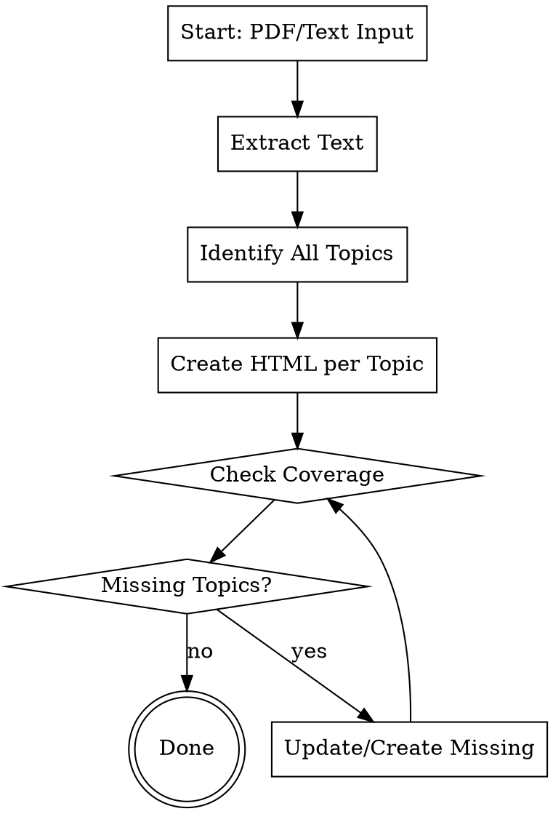

# Textbook to HTML Converter

## Overview

Converts textbook chapters (PDF or extracted text) into comprehensive, interactive HTML learning files optimized for exam preparation. The process loops until every concept is covered with multiple examples.

## When to Use

- User wants to study from a textbook PDF
- User needs comprehensive exam preparation materials
- User wants interactive HTML files with animations
- User wants to ensure no concept is missed

## Core Workflow



## MANDATORY WORKFLOW (Follow Exactly)

**DO NOT skip any phase. DO NOT stop until coverage.txt shows 100%.**

### Phase 1: Extract Content (MANDATORY)

1. **If PDF:** Use `pypdf` to extract text from specified pages
   ```bash
   python3 -c "
   from pypdf import PdfReader
   reader = PdfReader('textbook.pdf')
   for i, page in enumerate(reader.pages[START:END]):
       print(f'=== PAGE {START+i+1} ===')
       print(page.extract_text())
   " > extracted.txt
   ```

2. **Read the extracted text completely** - DO NOT skim

### Phase 2: Build Topic Inventory (MANDATORY)

Create `topics.txt` with this EXACT format:
```
TOPIC: Topic Name
  SUBTOPIC: Subtopic 1
    FORMULA: formula description
    ALGORITHM: algorithm name
  SUBTOPIC: Subtopic 2
  EXAMPLES: minimum 3 needed
STATUS: pending
---
```

**Scan for EVERY:**
- Formula (with all variables defined)
- Algorithm (with pseudocode)
- Definition
- Theorem or property
- Special case / edge case
- Comparison (e.g., Row vs Column major)
- Example worked in textbook

### Phase 3: Create HTML Files (MANDATORY)

For EACH topic in topics.txt, create `[topic-name]-comprehensive.html`

**Required Elements:**
1. Tabbed navigation
2. ALL formulas with variable definitions
3. Algorithm pseudocode
4. 3-5 worked examples
5. Comparison tables
6. Time/space complexity
7. Warning boxes for common mistakes

### Phase 4: Coverage Verification (MANDATORY)

1. **Copy coverage-template.txt to coverage.txt**
2. **Fill in all fields** with actual topic counts
3. **Run verification script:**
   ```bash
   python3 verify_coverage.py coverage.txt /path/to/html/files
   ```
4. **Check output** - must show "ALL TOPICS COVERED"

### Phase 5: LOOP Until 100% (MANDATORY)

**RUN verification script. If it shows gaps, DO NOT STOP.**

Loop:
1. Run: `python3 verify_coverage.py coverage.txt /path/to/html/files`
2. Find first gap from output
3. Create or update HTML to fix gap
4. Update coverage.txt
5. Re-run verification script
6. Repeat until output shows "ALL TOPICS COVERED"

**STOP only when verification script outputs:**
```
STATUS: ✓ ALL TOPICS COVERED
```

### Phase 6: Final Report (MANDATORY)

Output summary:
```
=== CONVERSION COMPLETE ===
Source: textbook.pdf pages X-Y
Topics covered: N
HTML files created: N
Total formulas: N
Total algorithms: N
Total examples: N
Coverage: 100%
Files: [list all HTML files]
```

## Files in This Skill

- `SKILL.md` - This file (workflow and instructions)
- `html-template.html` - Reusable HTML template with styling
- `coverage-template.txt` - Copy this to create coverage.txt tracker
- `verify_coverage.py` - Script to verify coverage automatically

## HTML Template

Use `html-template.html` for consistent styling across all files.

## Quality Checklist

Each HTML file must have:
- [ ] Dark theme with green/orange accents
- [ ] Tabbed navigation for sub-topics
- [ ] All formulas from textbook
- [ ] Algorithm pseudocode
- [ ] 3-5 worked examples
- [ ] Comparison tables
- [ ] Time/space complexity
- [ ] Warning boxes for common mistakes
- [ ] Quick reference cards
- [ ] Responsive layout

## Common Mistakes to Avoid

1. **Don't skip topics** - Every concept must have an HTML
2. **Don't have just one example** - Minimum 3 per concept
3. **Don't forget formulas** - All equations must be included
4. **Don't skip edge cases** - Include special cases
5. **Don't forget complexity** - Time and space for all algorithms

## Example Usage

```
User: "Read chapter 3 of this PDF and create HTML files for exam prep"

Agent:
1. Extract text from PDF pages 74-99
2. Identify topics: Arrays, Matrix Operations, Sparse Matrix, 
   String Matching, Linked Lists, Stacks, Queues, Expressions
3. Create 9 HTML files covering all topics
4. Check coverage - found missing "Binary Search"
5. Create search-algorithms-comprehensive.html
6. Re-check - all topics covered
7. Report: "All 9 topics covered with 45+ examples total"
```

## File Naming Convention

`[topic-name]-comprehensive.html`

Examples:
- `array-address-comprehensive.html`
- `linked-list-comprehensive.html`
- `stack-comprehensive.html`

## Integration with Other Skills

- Use `algorithm-animation` skill for interactive animations
- Use `cram-notes` for summary notes
- Use `cram-notes-fa` for Persian/Farsi content
