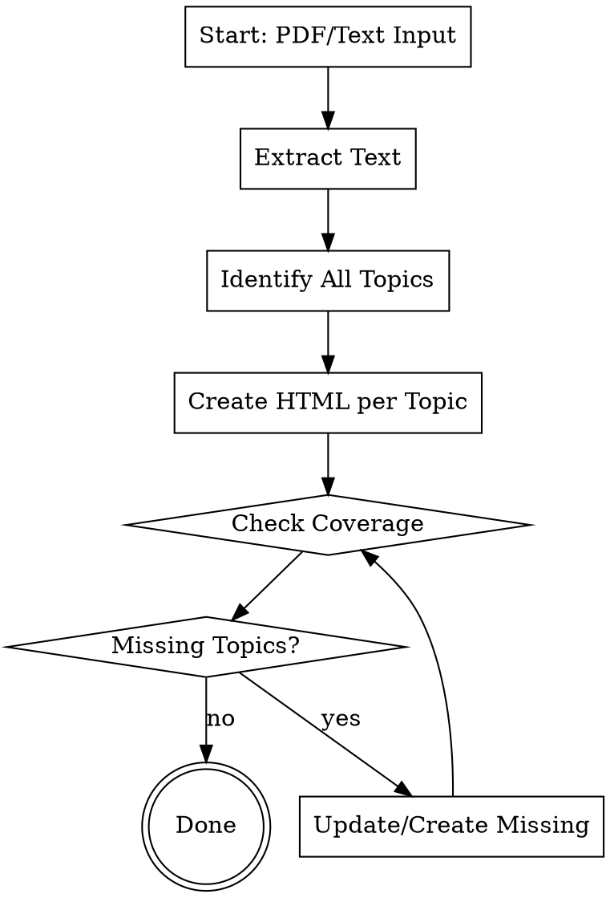

# Textbook to HTML Converter

## Overview

Converts textbook chapters (PDF or extracted text) into comprehensive, interactive HTML learning files optimized for exam preparation. The process loops until every concept is covered with multiple examples.

## When to Use

- User wants to study from a textbook PDF
- User needs comprehensive exam preparation materials
- User wants interactive HTML files with animations
- User wants to ensure no concept is missed

## Core Workflow



## Step-by-Step Process

### Phase 1: Extract Content

1. **If PDF:** Use `pypdf` to extract text from all pages
   ```bash
   python3 -c "
   from pypdf import PdfReader
   reader = PdfReader('textbook.pdf')
   for i, page in enumerate(reader.pages):
       print(f'=== PAGE {i+1} ===')
       print(page.extract_text())
   " > extracted.txt
   ```

2. **If text file:** Read directly

3. **Identify page ranges** for each chapter/section

### Phase 2: Topic Identification

Read extracted text and list ALL topics:
- Main concepts (e.g., "Array Address Calculation")
- Sub-concepts (e.g., "Row Major", "Column Major")
- Algorithms (e.g., "Binary Search", "KMP")
- Formulas and equations
- Special cases and edge cases

### Phase 3: Create HTML Files

For EACH topic, create a comprehensive HTML file:

**Required Structure:**
```html
<!DOCTYPE html>
<html lang="en">
<head>
  <meta charset="UTF-8">
  <title>[Topic Name] - Comprehensive</title>
  <style>
    /* Dark theme with green/orange accents */
    * { margin: 0; padding: 0; box-sizing: border-box; }
    body { background: #0a0a1a; color: #e0e0e0; font-family: 'Courier New', monospace; }
    /* ... full styling ... */
  </style>
</head>
<body>
  <h1>[TOPIC NAME]</h1>
  <p class="subtitle">Data Structures — Complete Guide for 20/20 Exam</p>
  
  <div class="container">
    <!-- Tabs for sub-topics -->
    <div class="tabs">
      <button class="tab active" onclick="showSection('tab1')">Tab 1</button>
      <button class="tab" onclick="showSection('tab2')">Tab 2</button>
    </div>
    
    <!-- Content sections -->
    <div class="content active" id="tab1">
      <div class="section">
        <h2>Section Title</h2>
        <!-- Formulas, examples, tables -->
      </div>
    </div>
  </div>
  
  <script>
    function showSection(id) {
      document.querySelectorAll('.content').forEach(el => el.classList.remove('active'));
      document.querySelectorAll('.tab').forEach(el => el.classList.remove('active'));
      document.getElementById(id).classList.add('active');
      event.target.classList.add('active');
    }
  </script>
</body>
</html>
```

**Required Elements per HTML:**
1. **Formulas** - All equations with clear labels
2. **Algorithms** - Pseudocode in code blocks
3. **Examples** - Multiple worked examples (3-5 minimum)
4. **Tables** - Comparison tables, complexity tables
5. **Visual Diagrams** - ASCII art or CSS-based visuals
6. **Warning Boxes** - Common mistakes and exam tips
7. **Grid Cards** - Quick reference summaries

### Phase 4: Coverage Check

After creating all files, verify coverage:

1. **List all topics from extracted text**
2. **Check each topic has an HTML file**
3. **Check each HTML has:**
   - All formulas from textbook
   - All algorithms with pseudocode
   - Multiple examples (not just one)
   - Time/space complexity
   - Edge cases and special cases

4. **Identify gaps:**
   - Missing topics
   - Topics with insufficient examples
   - Missing formulas or algorithms

### Phase 5: Loop Until Complete

If gaps found:
1. Create new HTML files for missing topics
2. Update existing files with more examples
3. Re-check coverage
4. Repeat until 100% covered

## HTML Template

Use the template in `html-template.html` for consistent styling.

## Quality Checklist

Each HTML file must have:
- [ ] Dark theme with green/orange accents
- [ ] Tabbed navigation for sub-topics
- [ ] All formulas from textbook
- [ ] Algorithm pseudocode
- [ ] 3-5 worked examples
- [ ] Comparison tables
- [ ] Time/space complexity
- [ ] Warning boxes for common mistakes
- [ ] Quick reference cards
- [ ] Responsive layout

## Common Mistakes to Avoid

1. **Don't skip topics** - Every concept must have an HTML
2. **Don't have just one example** - Minimum 3 per concept
3. **Don't forget formulas** - All equations must be included
4. **Don't skip edge cases** - Include special cases
5. **Don't forget complexity** - Time and space for all algorithms

## Example Usage

```
User: "Read chapter 3 of this PDF and create HTML files for exam prep"

Agent:
1. Extract text from PDF pages 74-99
2. Identify topics: Arrays, Matrix Operations, Sparse Matrix, 
   String Matching, Linked Lists, Stacks, Queues, Expressions
3. Create 9 HTML files covering all topics
4. Check coverage - found missing "Binary Search"
5. Create search-algorithms-comprehensive.html
6. Re-check - all topics covered
7. Report: "All 9 topics covered with 45+ examples total"
```

## File Naming Convention

`[topic-name]-comprehensive.html`

Examples:
- `array-address-comprehensive.html`
- `linked-list-comprehensive.html`
- `stack-comprehensive.html`

## Integration with Other Skills

- Use `algorithm-animation` skill for interactive animations
- Use `cram-notes` for summary notes
- Use `cram-notes-fa` for Persian/Farsi content
